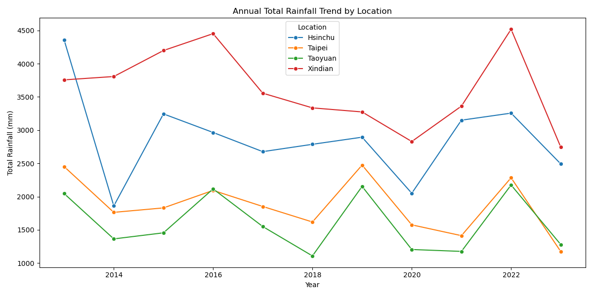
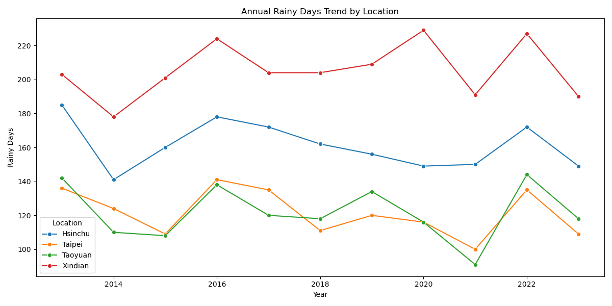
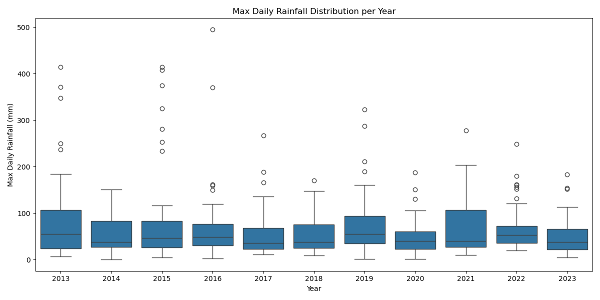
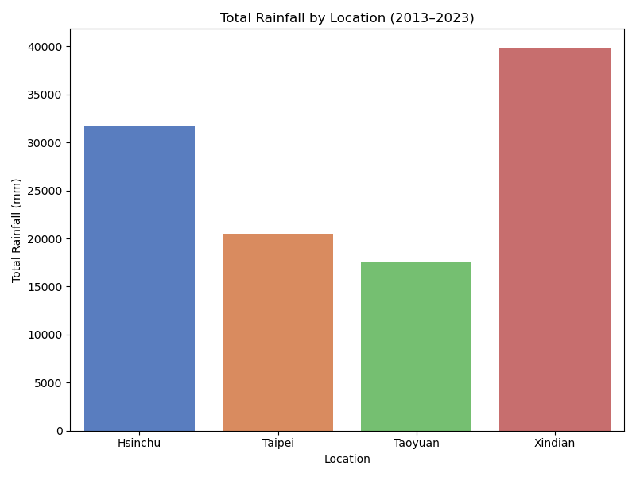

# North Taiwan Rainfall Trends (2013–2023)

## Introduction

This project investigates rainfall trends in Northern Taiwan from 2013 to 2023.  
The main research question is:

**Has Northern Taiwan become wetter in over the past decade?**

To answer this, I analyzed monthly and annual rainfall data from four weather stations:
- Xindian (C1A9N0)
- Taipei (C1AC50)
- Taoyuan (C1C510)
- Hsinchu (C1D400)

Each station provided over 11 years of data, satisfying the requirement for long-term trend analysis.

---

## Data Description

The raw data is sourced from the Taiwan Central Weather Administration (CWA) via the National Science and Technology Center for Disaster Reduction (NCDR) website.  
It includes the following columns for each station and month:
- `MonthlyRainfall_mm`: Total rainfall in mm per month
- `RainyDays`: Number of days with precipitation in a month
- `MaxDailyRainfall_mm`: Maximum daily rainfall in the month
- `MaxDailyRainfallDateTime`: The day the max rainfall occurred

Data was cleaned and merged into a single file for analysis.

---

## Analysis & Visualizations

### 1. Annual Total Rainfall Trend

We observe that **Xindian consistently receives the most rainfall**, followed by Hsinchu.  
While fluctuations exist year to year, **there is no strong evidence of an upward or downward trend** across all stations.

---

### 2. Annual Rainy Days Trend

This chart shows the total number of rainy days each year.  
Although rainfall volume has not changed drastically, **rainy days in Xindian and Hsinchu remain higher**, suggesting a more humid local climate.

---

### 3. Max Daily Rainfall Distribution

A boxplot showing the spread of extreme rain events.  
While most stations have stable max daily rainfall, **we occasionally see spikes above 400–500 mm**, especially in Xindian and Hsinchu, indicating occasional extreme events.

---

### 4. Total Rainfall by Location (2013–2023)

Xindian received nearly **40,000 mm** of rainfall over the 10-year period, the highest among the four stations.  
This matches expectations due to its geographical location near mountainous terrain.

---

## Conclusion

- **Is Northern Taiwan getting wetter?**  
  There is no clear increasing trend across all stations, but Xindian consistently shows high rainfall and frequent rain days.

- **Are extreme rainfall events increasing?**  
  Some years saw unusually high daily rainfall, but no clear increasing pattern.

- **Main insight:**  
  While overall climate appears relatively stable, local geography plays a major role in rainfall volume.  
  Xindian and Hsinchu are more vulnerable to high precipitation and should be considered in flood mitigation strategies.

---

## Limitations

- Only 11 years of data; longer datasets may reveal more patterns.
- Monthly aggregation may obscure more granular short-term events.

---

## Future Work

- Expand analysis to include temperature, wind speed, or typhoon events.
- Build predictive models using time series methods (ARIMA).
- Compare with other regions in Taiwan.

---

## Author

Caroline Kuo  
GitHub: [Tiff0416](https://github.com/Tiff0416)
